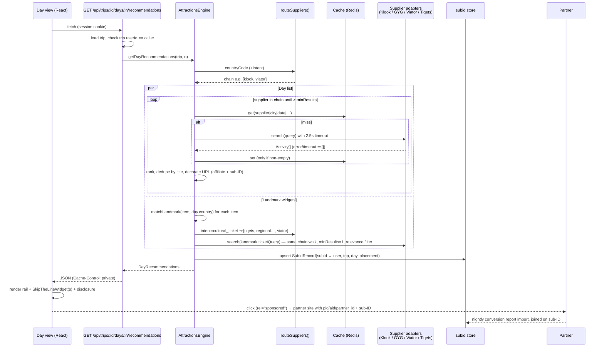

# WanderNests — Global Attractions Recommendation & Affiliate Engine

## 1. Goals

| Requirement | Where it lives |
|---|---|
| Geo-routing to the right affiliate supplier per destination | `src/routing/supplierRouter.ts`, `src/geo/regions.ts` |
| Universal fallback to Viator when the regional partner lacks inventory | `AttractionsEngine.fetchFromChain` |
| Tiqets for museums / cultural hubs (global) | `routeSuppliers({ intent: 'cultural_ticket' })` |
| Per-day, per-location recommendations from the itinerary | `AttractionsEngine.getDayRecommendations` |
| Contextual "Skip-the-line" widget when a landmark is added | `src/landmarks/landmarkCatalog.ts`, `AttractionsEngine.getLandmarkWidgets` |
| Affiliate params + per-user/trip sub-IDs on every outbound link | `src/tracking/affiliateLinks.ts` |
| Mobile-first UI with an affiliate disclosure | `ui/RecommendedActivities.tsx`, `ui/attractions.css` |

## 2. Data flow



## 3. Tenancy: public app vs. agency apps

The aggregator engine runs **only on the public consumer app**. Each travel agency has its own white-label app on a subdomain, for example `shasha.wandernests.app` or `rimon.wandernests.app`. There the traveller is the agency's customer, so recommendations must come from the agency, not from an aggregator.

| Host | Tenant | Recommendation mode |
|---|---|---|
| `wandernests.app`, `www.wandernests.app` | public | `affiliate` (this engine) |
| `<agency>.wandernests.app` | agency | `none` (default; per-agency override possible) |
| `biz.`, `wandernests-admin.` (business and admin consoles) | unknown | `none` |
| reserved subdomains (`api`, `admin`, `staging`…), nested subdomains, other hosts, localhost | unknown | `none` (fail-closed) |

**The decision depends only on which app the request comes from (the host), not on who the user is.** Users of the public app get the engine, including agency clients and agency-owned trips. Nobody gets it on an agency's subdomain.

* Enforcement is **server-side** in `recommendationsController`. On a non-public host it returns an empty `DayRecommendations` with no supplier calls, no affiliate links and no sub-IDs. The UI already renders nothing for an empty response. Responses carry `Vary: Host`.
* The host must come from a trusted source. The main app already resolves it with `clientHostFrom()` and `brandSlugFromHost()` in `src/lib/brand-host.ts`, so reuse those when integrating. The reserved labels here (`biz`, `admin`, `wandernests-admin`) match that file.
* **Agency recommendations already exist** in the main app as `agency_offers` (migration 0021). This is the natural content for agency apps, instead of aggregator inventory.

## 3a. Routing rules

`routeSuppliers()` is a **pure function**: (country, intent, override, disabled set) → ordered chain.

1. Landmark override (`Landmark.preferredSupplier`, for official/exclusive ticket allocations)
2. `tiqets`, when the intent is `cultural_ticket` (museums, monuments, religious sites — global)
3. Regional priority:

   | Region | Chain |
   |---|---|
   | Asia & Pacific (incl. Oceania, South & Central Asia) | Klook |
   | Europe | GetYourGuide → Viator |
   | Americas | Viator → GetYourGuide |
   | Middle East & Africa | Viator → GetYourGuide |
   | Unknown country | Viator |

4. `viator` is always appended as the universal fallback.

Duplicates are removed in order, and suppliers in `disabledSuppliers` are dropped. That set works as a kill-switch, for example while a partner API is down or a contract is paused.

**Fallback semantics.** The engine walks the chain in order. If a supplier returns fewer than `minResults` (default 4), it moves to the next supplier and tops up. A supplier that errors or times out counts as having no inventory, so the walk falls through to the next one. Results from the primary supplier always come first. Results from later suppliers are flagged `isFallback: true`, so analytics can measure how often each regional partner falls short in each city.

## 4. Affiliate tracking

* **Static params** per partner (`pid`/`mcid` for Viator, `partner_id` for GYG, `aid` for Klook, `partner` for Tiqets) come from env config (`affiliateConfigFromEnv`). The parameter names are config, not code. **Verify them against each partner dashboard before launch.**
* **Sub-ID:** `wn-<HMAC(userId:tripId)[0..12]>-d<dayIndex>-<placement>`
  * Opaque: raw user and trip IDs never reach third-party logs.
  * Deterministic: the same user, trip, day and placement always produce the same sub-ID, so writes are idempotent upserts.
  * Placement-aware: `dl` is the day list and `lw` is the landmark widget, so the two surfaces can be A/B tested.
  * `onSubIdIssued` persists `SubIdRecord`. The nightly import of partner conversion reports joins on the sub-ID to attribute bookings to trips.
* **Safety.** `decorateUrl` only tags `https` URLs on the partner's own allow-listed hosts. A malformed or hostile API payload therefore can't turn a card into a tagged link to an arbitrary site. Affiliate params override any same-named params that are already in the URL.
* **Links** are rendered with `rel="sponsored noopener noreferrer"` and `target="_blank"`.

Suggested table:

```sql
create table affiliate_subids (
  sub_id     text primary key,
  user_id    uuid not null references users(id),
  trip_id    uuid not null references trips(id),
  day_index  int  not null,
  placement  text not null,
  created_at timestamptz not null default now()
);
```

## 5. Performance and resilience

* Each supplier gets its own timeout (`supplierTimeoutMs`, default 2.5 s) through `AbortController`. One slow partner never blocks the day view.
* Supplier results are cached **before** affiliate decoration, keyed by supplier, country, city, date, currency, locale and text. The cache is therefore shared across users, and the sub-IDs are added per request. Empty results are not cached, so a short gap in inventory doesn't lock in the fallback for the whole TTL.
* The day list and landmark widgets are fetched in parallel.
* Past days return immediately and make no supplier calls.
* The HTTP response is `Cache-Control: private` because the links are tied to the user.

## 6. UI

* `RecommendedActivities` is a horizontal scroll-snap rail on mobile (cards are 78vw, max 280px). From 960px it becomes a wrapping grid. It shows skeletons while loading and renders nothing when there are no results.
* `SkipTheLineWidget` is a compact inline prompt directly under the matching itinerary item, with a 44px touch target on the CTA.
* `AffiliateDisclosure` shows the subtle "Booked via trusted partners at no extra cost" line in both components.
* Colours, radii, spacing and fonts come from `--wn-*` design tokens, with fallbacks and dark-mode support. Reduced-motion preferences are respected.
* `ui/DayViewExample.tsx` shows how it fits into the day view and how click analytics are wired.

## 7. Module layout

```
src/
  types.ts                         domain types
  geo/regions.ts                   ISO country → macro region
  routing/supplierRouter.ts        pure geo-routing → supplier chain
  landmarks/landmarkCatalog.ts     landmark seed data + accent-insensitive matcher
  suppliers/SupplierAdapter.ts     adapter contract
  suppliers/httpAdapters.ts        Viator / GYG / Klook / Tiqets request + response mappers
  tracking/affiliateLinks.ts       affiliate params, sub-IDs, URL decoration
  cache.ts                         cache contract + in-memory TTL cache
  AttractionsEngine.ts             orchestration: routing, fallback, ranking, widgets
  tenancy/tenant.ts                host → public/agency tenant → recommendation mode
  server/recommendationsController.ts  framework-agnostic HTTP handler with authz + tenant gating
ui/
  RecommendedActivities.tsx        rail, card, skip-the-line widget, disclosure, data hook
  attractions.css                  token-driven, mobile-first styles
  DayViewExample.tsx               integration example
test/                              vitest: routing, links, engine fallback, adapters, UI render
```

## 8. Before go-live

1. Get partner API credentials. Run each `httpAdapters.ts` mapper against the sandbox and fix any field names that differ. Klook API access and its base URL depend on the partner agreement.
2. Confirm the affiliate deep-link parameter names, especially Klook's sub-ID parameter (`KLOOK_SUBID_PARAM`).
3. Move `LANDMARKS` into the database, keyed by `placeId` so matching is exact. Keep the text matcher as a fallback.
4. Back `Cache` with Redis. Add a circuit breaker that feeds `disabledSuppliers`.
5. Build the nightly conversion-report importer for each partner, joining on `affiliate_subids`.
6. Have the disclosure copy legally reviewed in each market (FTC in the US, CMA/ASA in the UK, and the EU UCPD).
